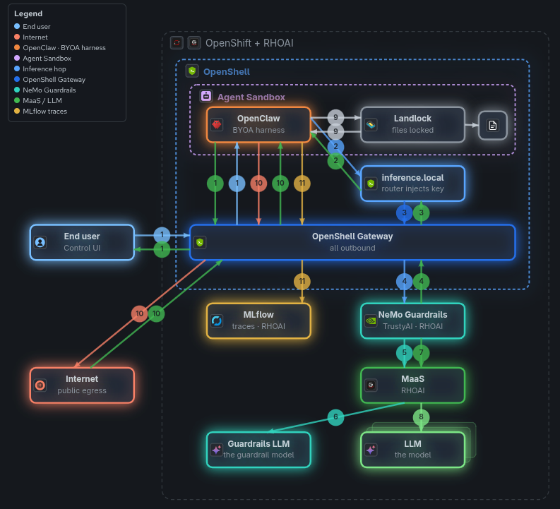

# AgentOps Showcase - Enterprise Secure Agent Platform

Demo showcasing a complete enterprise-grade platform for deploying, securing, and observing AI agents on Red Hat OpenShift AI 3.x.

## What is this?

This project demonstrates the **BYOA (Bring Your Own Agent)** approach from the Red Hat AI Agentic Strategy 2026: customers choose any agent framework, Red Hat provides the production-ready infrastructure underneath.

**Key message**: *Your Agent. Our Platform. Production-Ready.*

## Architecture



*Interactive map:* [v5/live.html](docs/demo/v5/live.html) step **Overall Demo** (`./scripts/demo-presenter-serve.sh`). Standalone reference: [`overall-demo-architecture.html`](docs/demo/overall-demo-architecture.html). Regenerate after diagram changes: `make export-architecture`.

## Platform Stack

```
┌─────────────────────────────────────────────────────────────┐
│ USER LAYER                                                  │
│ End user → Control UI (openclaw-ui-proxy, nginx mTLS bridge)│
├─────────────────────────────────────────────────────────────┤
│ AGENT LAYER (BYOA — demo harness: OpenClaw)                 │
│ OpenClaw in Agent Sandbox (OpenShell policies: Landlock)  │
├─────────────────────────────────────────────────────────────┤
│ PLATFORM LAYER (Red Hat)                                    │
│ OpenShell Gateway (egress choke point, key injection)       │
│ MLflow — tracing + prompt registry (background spans)       │
│ NeMo Guardrails via TrustyAI (enabled live in Change 2)     │
├─────────────────────────────────────────────────────────────┤
│ INFERENCE LAYER                                             │
│ inference.local → [NeMo] → MaaS → LLM (external MaaS)       │
├─────────────────────────────────────────────────────────────┤
│ INFRASTRUCTURE                                              │
│ OpenShift + RHOAI 3.x · Agent Sandbox Operator (OLM)        │
└─────────────────────────────────────────────────────────────┘
```

The agent harness is interchangeable (BYOA); the platform stack works regardless of framework. Interactive architecture map (live): [v5/live.html](docs/demo/v5/live.html) step **Overall Demo**. Deep dive: [Agent Sandbox and OpenShell — How It Works](docs/AGENT-SANDBOX-AND-OPENSHELL.md).

## Understanding the Platform

**Start here** if you want to understand how agent isolation actually works in this demo: [Agent Sandbox and OpenShell — How It Works](docs/AGENT-SANDBOX-AND-OPENSHELL.md).

That guide walks through the full stack — Agent Sandbox Operator, OpenShell gateway, sandbox policies (Landlock, network namespaces), and how OpenClaw runs inside an isolated sandbox rather than as a plain Kubernetes Deployment. It complements the install guides (`cluster-bootstrap.md`, `openshell-installation.md`) with architecture and the `launch-openclaw.sh` procedure.

## Version Pinning

All operators and components use **explicit pinned versions**. We upgrade deliberately and test before bumping to avoid surprises from upstream releases. See [AGENTS.md](AGENTS.md) for the full version pinning policy.

## Demo Highlights

- **Security**: NeMo Guardrails block prompt injection, topic deviation, and data exfiltration
- **Isolation**: OpenShell sandboxes agent execution with zero-trust principles
- **Observability**: MLflow captures full agent execution traces via the mlflow-openclaw plugin
- **Prompt Management**: Versioned prompts in MLflow Prompt Registry enable A/B testing
- **Platform Agnostic**: The agent framework is interchangeable - the platform works regardless

## Quick Start

```bash
# Full demo (from repo root)
make demo

# Platform only
make deploy-all && make validate
```

| Step | Guide |
|---|---|
| Bootstrap RHOAI platform on OpenShift | [docs/cluster-bootstrap.md](docs/cluster-bootstrap.md) |
| Install OpenShell (local or cluster) | [docs/openshell-installation.md](docs/openshell-installation.md) |
| Agent Sandbox + OpenShell architecture (OpenClaw in sandbox) | [docs/AGENT-SANDBOX-AND-OPENSHELL.md](docs/AGENT-SANDBOX-AND-OPENSHELL.md) |
| Browser UI (nginx mTLS bridge + password) | `make deploy-agent` or `make demo` — see [ADR-0011](docs/adr/0011-openclaw-ui-auth-nginx-bridge-password.md) |

## Project Structure

```
├── Makefile               # Wrapper → deploy/Makefile (make demo, deploy-all, …)
├── AGENTS.md              # AI agent context (for Cursor/Claude)
├── README.md              # This file
├── assets/                # README diagrams (overall-architecture.png — see make export-architecture)
├── config/                # OpenClaw template + OpenShell sandbox policies
├── docs/                  # Guides, ADRs, demo narrative, ROADMAP
├── deploy/                # Helm charts + deploy/Makefile
│   └── helm/              # operators, platform, mlflow, guardrails, openshell, …
├── agent/workspace/       # OpenClaw workspace identity files
├── tests/                 # Playwright E2E + health-check.sh
├── scripts/               # cluster-lifecycle, demo-*, launch-openclaw, …
└── secrets/               # secrets.env (gitignored)
```

## Documentation

- [NeMo Guardrails Installation](docs/nemo-guardrails-installation.md)
- [Demo script (live, ~9–10 min)](docs/demo-script.md) — Cursor skills in [AGENTS.md](AGENTS.md) § Demo v1
- [Demo scenario logs runbook](docs/demo/demo-scenario-logs.md) — per-test log evidence and [Sandbox panel highlight rules](docs/demo/demo-scenario-logs.md#sandbox-panel-highlight-rules)
- [Demo narrative v1 (Spanish)](docs/demo-narrative-v1.md)
- [Demo presenter UI](docs/demo/README.md) — `v5/live.html` live companion + observability panel
- [docs/ROADMAP.md](docs/ROADMAP.md) - Development roadmap and task tracking
- [docs/cluster-bootstrap.md](docs/cluster-bootstrap.md) - RHOAI platform deploy, validate, and teardown on OpenShift
- [docs/openshell-installation.md](docs/openshell-installation.md) - OpenShell install (local macOS/Linux + OpenShift Helm chart)
- [docs/AGENT-SANDBOX-AND-OPENSHELL.md](docs/AGENT-SANDBOX-AND-OPENSHELL.md) - Agent Sandbox, OpenShell, and OpenClaw launch architecture
- [docs/stack-decisions.md](docs/stack-decisions.md) - Architecture decisions executive summary
- [docs/adr/](docs/adr/) - Full Architecture Decision Records
- [docs/github-actions.md](docs/github-actions.md) - GitHub Actions CI (PR unit tests + Helm lint)

## Target Environment

- **Platform**: Red Hat OpenShift AI (RHOAI) 3.x
- **Cluster**: demo.redhat.com / RHPDS
- **Inference**: External MaaS endpoint
- **Version Policy**: All operators pinned to explicit versions (no automatic updates)

## Contributing

This is a collaborative project. See [AGENTS.md](AGENTS.md) for the full context on architecture decisions and constraints.

## License

Apache-2.0
