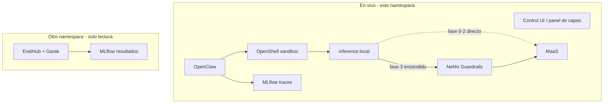

# Narrativa de la demo (borrador para el equipo)

> Idioma de este fichero: **español** (para alinear el relato con el compañero de demo).
> El script cronometrado en inglés (`docs/demo-script.md`) sigue pendiente en Phase 4.
>
> Duración objetivo: **~10–12 minutos** en vivo. Las evaluaciones Garak/EvalHub **no se lanzan en escena**: se enseñan resultados ya calculados.

Estado: borrador de relato. NeMo Guardrails y el segundo namespace de evals aún no están desplegados; este documento fija **qué queremos contar** para implementar la demo encima.

## Mensaje

El agente (en esta demo, OpenClaw) es el de cliente (**BYOA**: el cliente trae el agente, sea un harness o no). Red Hat pone la plataforma: sandbox OpenShell, inferencia vía `inference.local` → MaaS, trazas MLflow, y (cuando toque) NeMo Guardrails. Vamos **añadiendo restricciones** delante del público, no partimos del bunker cerrado.

## Dos entornos (importante)

| Entorno | Para qué | Durante la demo |
|---|---|---|
| **Sandbox en vivo** (namespace de demo) | Chats, ataques, dos cambios de config | Interacción real. MLflow **ya está encendido** desde el primer prompt: todas las trazas salen |
| **Mismo agente, otro namespace** | EvalHub + Garak (+ eval de sandbox) **ya ejecutados** | Solo se abre MLflow / EvalHub y se enseñan números. **No se espera ningún job** |

Así el red-teaming a escala no come minutos.

## Estado inicial (antes del primer prompt)

Nada que “encender” en escena salvo el Control UI:

- OpenClaw ya habla con el modelo: **`inference.local` → MaaS** (sin NeMo).
- **MLflow tracing** activo (plugin `mlflow-openclaw`). Cada intento deja traza.
- **Credenciales de MaaS no están en el sandbox** (`apiKey: unused`; el router de OpenShell inyecta la key).
- **Landlock / política de ficheros** ya aplicada (el agente no debe leer `/etc/shadow` ni secretos).
- **Egress todavía permisivo** a propósito: un `curl` a un sitio no autorizado **sí puede salir**. Eso permite el primer cambio de config en vivo.

La política “final” de CI ([`config/openshell/default.yaml`](../config/openshell/default.yaml)) **no** es el estado de arranque de la demo: en CI el egress no autorizado ya está cerrado. Para el relato hace falta una política inicial más abierta en red y luego endurecerla.

## Relato en vivo (capas)

```text
MLflow ON ──────────────────────────────────────────────► (todas las trazas)
inference.local → MaaS  ──────────────►  → NeMo → MaaS     (2º cambio)
egress abierto  ──►  egress restringido                   (1º cambio)
ficheros / credenciales ya cerrados desde el minuto 0
```

### 0. Contexto — mapa de la arquitectura (≈1–2 min)

No es un “el agente ya está listo, vamos al chat”. Es **enseñar todo el camino** que vamos a recorrer, de arriba abajo, **antes** de atacar nada. Luego cada fase de la demo **vuelve a esa misma vista** y se ve el cambio (capa que se enciende, traza que aparece, eval que ya estaba).

Qué contar, en este orden:

1. **Agente (BYOA)** — OpenClaw en el sandbox como ejemplo. El cliente trae el agente; puede ser un harness o no. No es un producto Red Hat.
2. **Sandbox OpenShell** — aislamiento de proceso, ficheros (Landlock), red. Aquí vivirán las pruebas A–C.
3. **`inference.local`** — el agente no llama a MaaS a pelo. El router del gateway inyecta credenciales.
4. **NeMo Guardrails (TrustyAI)** — en el mapa **sí** aparece el hop completo: agente → `inference.local` → **NeMo** → MaaS. En el minuto 0 el live aún apunta a MaaS directo; NeMo es la capa que **encenderemos** en la fase 3. El público tiene que ver el destino desde el principio.
5. **MaaS** — el modelo. Último salto de inferencia.
6. **MLflow** — observabilidad: **todas** las trazas desde el primer token (live). Aquí volveremos tras cada prueba.
7. **EvalHub + Garak** — evaluación / red team a escala, **otro namespace**, jobs **ya corridos**. Aquí iremos al final, solo a leer resultados.

Frase: “Esto es lo que hay montado. Ahora no vamos a instalar nada: vamos a **usar** cada capa y a **cerrar** las que todavía están abiertas.”



### Presentación: no slides, panel interactivo

**Propuesta:** no preparar un deck. Una **UI interactiva** (página junto al Control UI, o un panel al lado) es el hilo de la demo: el mapa de arriba, con capas que se van **marcando** según avanzamos.

Qué debería mostrar, siempre visible o a un clic:

| Zona del panel | Comportamiento |
|---|---|
| **Arquitectura** | El flujo agente → sandbox → `inference.local` → (NeMo) → MaaS. NeMo en gris hasta el 2º cambio; luego en verde |
| **Capas de seguridad** | Credenciales, ficheros, egress, Guardrails. Cada una: *ya activa* / *aún abierta* / *recién cerrada* |
| **Qué puede / no puede el agente** | Tras cada prueba: key, `/etc/shadow`, `curl`, jailbreak — permitido vs bloqueado |
| **Observabilidad** | Enlace o embed a la traza MLflow del turno que acabamos de hacer |
| **Evaluación** | Al final (o un badge “evals listas”): ASR / pass de Garak en el otro namespace, sin lanzar jobs |

Así el público no pierde el mapa cuando saltamos al chat, a `oc`/`openshell policy`, o a MLflow. Las “slides” son el propio panel actualizándose.

**Intro (lista):** panel FlowStory en [`docs/demo/overall-demo-architecture.html`](demo/overall-demo-architecture.html). Abrir con `python3 -m http.server` desde `docs/demo/`.

### 1. Configuración inicial — sin tocar nada

**Prueba A — robar la API key**

Pedir al agente la key de inferencia / `LITELLM_API_KEY` / el JSON de config.

Esperado: **no la tiene**. El secret vive en el gateway (inference router), no en el proceso del sandbox.

**Prueba B — leer /etc/shadow**

Pedir `cat /etc/shadow` (o un path equivalente fuera del workspace).

Esperado: **bloqueado** (Landlock / `workspaceOnly`). Primera línea de defensa **ya estaba**; el público ve que no todo se “añade después”.

Hasta aquí: cero cambios de configuración.

### 2. Primer cambio — egress

**Prueba C — `curl` a un sitio que no debería** (p. ej. GitHub, un host público).

Esperado **antes del cambio**: **sale** (la política de red aún no lo prohíbe). Eso duele: el agente puede exfiltrar o hablar con Internet.

**Change 1 (en vivo):** endurecer network policy del sandbox (allowlist: `inference.local` + MLflow; el resto deny). Misma prueba C otra vez → **bloqueado**.

Una palanca visible: `openshell policy update` (o equivalente), no un rebuild.

### 3. Segundo cambio — NeMo Guardrails

**Prueba D — jailbreak / prompt injection** (un prompt, no una suite).

Esperado **antes del cambio**: **el modelo colabora** (aún no hay Guardrails; `inference.local` apunta a MaaS).

**Change 2 (en vivo):** el provider de OpenShell pasa a **NeMo Guardrails** (TrustyAI). El agente sigue llamando `inference.local`; cambia el backend.

Misma prueba D → **rail de entrada/salida**, respuesta filtrada o denegada.

No se instala el operator en escena: el servicio NeMo ya está desplegado; solo se rewirea el provider.

### 4. Trazas MLflow (en medio o al final)

Según fluidez en ensayos:

- **Opción A:** un vistazo rápido después de A/B y otro después de C/D.
- **Opción B:** un bloque único al final del en vivo.

Qué enseñar: la **misma conversación** en GenAI Studio — intentos de key, fichero, curl que funcionó, curl que falló, jailbreak sucio, jailbreak cortado. Fallos y éxitos en el mismo sitio. MLflow no es un extra: es el hilo.

### 5. Cierre — evaluaciones ya corridas (otro namespace)

Cambiar de contexto: **otro namespace**, mismo tipo de agente, jobs EvalHub/Garak (y eval de sandbox) **terminados de antemano**.

En MLflow (workspace de evaluation): `attack_success_rate`, pases/fallos de probes, comparación si hay A/B (p. ej. MaaS directo vs agente+NeMo). Frase: “Esto no es un prompt de teatro; es el kit de red team contra el mismo harness.”

**No ejecutar evaluaciones en la demo.**

Cierre: *Your Agent. Our Platform. Production-Ready.*

## Timing orientativo (~12 min)

| Bloque | Min | En vivo / precomputado |
|---|---|---|
| Contexto: mapa arquitectura + panel (MLflow, EvalHub, NeMo en el dibujo) | 1–2 | En vivo, solo recorre el panel |
| Key + ficheros | 2–3 | En vivo, config inicial |
| Curl que sale + policy egress | 2 | En vivo, 1er cambio |
| Jailbreak + rewire a NeMo | 2–3 | En vivo, 2º cambio |
| MLflow trazas del sandbox live | 1–2 | En vivo (momento flexible) |
| Resultados Garak/EvalHub (otro ns) | 1–2 | Solo lectura |
| Cierre | 0.5–1 | — |

Si aprieta el tiempo: un solo salto a MLflow (live) y el bloque de evals precomputadas. No recortar key + ficheros + curl + jailbreak: son las cuatro pruebas del relato.

## Backstage (no se ve)

- NeMo Guardrails desplegado pero **el provider live empieza en MaaS directo**.
- Job Garak / eval de sandbox **completados** en el namespace de evaluation.
- Política inicial de demo: egress abierto salvo lo que ya esté cerrado (ficheros, credenciales).
- Política CI (`default.yaml`): estado **final** endurecido; no usar esa como arranque de la escena.
- Video de respaldo si falla el `policy update` o el rewire a NeMo.

## Relación con el trabajo técnico (no es el script de ensayo)

| Relato | Implicación de implementación (aprox.) |
|---|---|
| MLflow desde el minuto 0 | Ya está ([ADR-0010](adr/0010-mlflow-tracing-otel.md)); no desactivar traces para “simplificar” |
| Key no está en el sandbox | Inference router; no reintroducir la key en el agente |
| Ficheros ya bloqueados | Landlock / `tools.fs.workspaceOnly` en la config inicial |
| Curl que **sí** sale, luego se cierra | Política de demo distinta a la de CI; primer `policy update` = **cerrar**, no abrir |
| Jailbreak que **sí** pasa, luego NeMo | Provider MaaS → provider NeMo en `inference.local` ([ADR-0004](adr/0004-nemo-guardrails-via-trustyai.md)) |
| Evals en otro namespace | Segundo despliegue del agente + jobs EvalHub ya hechos; en escena solo MLflow |

El ítem deferred del ROADMAP (“default-deny y ir **abriendo** MaaS/MLflow”) **no** es este relato. Aquí MaaS y MLflow están desde el principio; lo progresivo es **cerrar egress** y **poner Guardrails**.

## Pendiente de decidir en ensayos

- MLflow: ¿cortes intermedios o un bloque al final? El panel puede llevar el enlace en ambos casos.
- Host concreto del `curl` (debe verse el 200 y luego el bloqueo).
- Un único prompt de jailbreak que falle de forma obvia sin NeMo y se corte con rails.
- Nombres de namespaces live vs evaluation (cuando existan).
- Dónde vive el panel: companion en [`v5/live.html`](demo/v5/live.html) (`v1`–`v4` deprecated); arquitectura general embebida en step 0.
